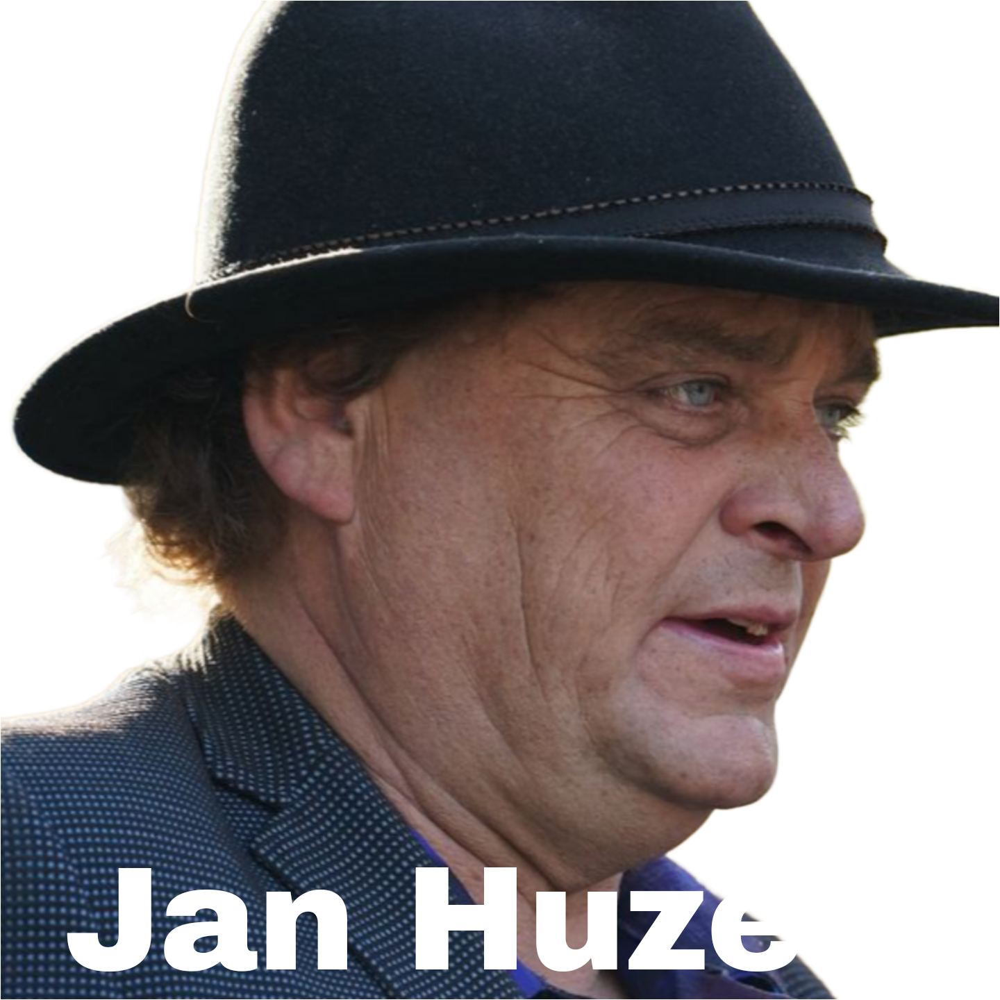

## I. Introductie: Het Ter Apel Incident en de Emergentie van Jan Huzen  

**A. Overzicht van de Burgergrenscontroles**

In het weekend van 7 en 8 juni 2025 vond bij de grensovergang tussen Ter Apel in Nederland en het Duitse Rütenbrock een spraakmakend incident plaats. Een groep van meer dan tien personen nam het recht in eigen hand door het uitvoeren van wat zij beschouwden als grenscontroles. Deze individuen, in sommige media omschreven als "rechtsextremisten" en door anderen, of henzelf, als "bezorgde burgers", hielden voertuigen staande om te controleren op de aanwezigheid van asielzoekers. De actie riep onmiddellijk scherpe veroordeling op van lokale autoriteiten. De gemeente Westerwolde, waartoe Ter Apel behoort, bestempelde het optreden als "levensgevaarlijk en verboden". Het feit dat Ter Apel een groot aanmeldcentrum voor asielzoekers huisvest, maakt de locatie significant en vaak het brandpunt van het Nederlandse migratiedebat. Deze gebeurtenis vormt een directe uitdaging aan het staatsgezag en voedt de bezorgdheid over eigenrichting en de openbare orde.  

**B. Introductie van Jan Huzen als Organisator** 

De organisatie van deze illegale grenscontroles wordt toegeschreven aan Jan Huzen. In verschillende media wordt hij omschreven als een "in het Noorden bekende complotdenker". Zijn betrokkenheid plaatst het incident direct in een bredere context van anti-establishmentactivisme en complotdenken. De identificatie van Huzen als spilfiguur is cruciaal voor het begrijpen van de mogelijke ideologische drijfveren en het netwerk achter deze acties.  

**C. Initieel Beeld en Opzet van dit Rapport** 

Het incident in Ter Apel lijkt een kookpunt waar frustraties over het nationale asielbeleid samenkomen met lokale spanningen, georkestreerd door een individu dat bekend staat om breder anti-establishmentactivisme. De acties bij de grens zijn niet slechts een uiting van lokale onvrede, maar worden waarschijnlijk versterkt en gevormd door een figuur die bedreven is in het mobiliseren van diverse vormen van ongenoegen, gezien Huzens eerdere steun aan "wappies" en "terrorboeren".  
De onmiddellijke en scherpe tegenstelling in de gebruikte terminologie – "rechtsextremisten" versus "bezorgde burgers" – en de uiteenlopende reacties, van veroordeling door officiële instanties tot steun van politici als Geert Wilders , illustreren de diep polariserende aard van de gebeurtenis. Het functioneert als een spiegel voor onderliggende maatschappelijke breuklijnen inzake migratie en autoriteit. Dit rapport analyseert het profiel van Jan Huzen, de details van de grenscontroles, de achterliggende motivaties, de officiële en juridische reacties, het publieke debat en de bredere implicaties van dergelijke burgerinitiatieven.  

## II. Profiel van Jan Huzen: Activisme, Associaties en Ideologie  

**A. Bekende Kwalificaties en Affiliaties** 

Jan Huzen wordt in mediabronnen consequent aangeduid als een "complotdenker". Deze benaming duidt op een wereldbeeld gekenmerkt door wantrouwen jegens officiële narratieven en een zoektocht naar alternatieve, vaak ongefundeerde, verklaringen voor gebeurtenissen. Dit kader is van belang voor het begrijpen van zijn motivaties en de aard van zijn achterban, die vaak sceptisch staat tegenover gevestigde instituties en media.  
Zijn eerdere steun aan "wappies" (een pejoratieve term voor personen die de ernst van COVID-19 ontkennen of zich verzetten tegen coronamaatregelen, vaak op basis van complottheorieën) en "terrorboeren" (een controversiële en eveneens pejoratieve term voor militante boeren) plaatst hem in de context van protesten tegen coronamaatregelen en radicale boerenacties. Deze geschiedenis toont een patroon van betrokkenheid bij anti-overheidsactivisme en een bereidheid zich te associëren met omstreden bewegingen. Een bron legt expliciet een verband tussen "tuigwappies" die eerder boerenprotesten "kaapten" en nu betrokken zijn bij de grenscontroles, wat impliceert dat het om dezelfde kringen rond Huzen gaat.  
Huzen wordt ook geassocieerd met de "Steungroep Boeren & Burgers". Deze groepering organiseerde in januari 2021 een "demotour" in Coevorden, waarbij met toeterende auto's door de straten werd gereden. Sommige media berichtten dat dit ter ondersteuning was van "veroorzakers van de overlast" in een lokale wijk, een lezing die Huzen via Facebook betwistte. Dit duidt op een bestaande organisatorische capaciteit en een historie van het mobiliseren van groepen voor publieke manifestaties van onvrede. De naam "Boeren & Burgers" suggereert een poging om een brug te slaan tussen rurale en urbane grieven.  

**B. Werkwijze en Communicatie** 

Sociale media, met name Facebook, spelen een centrale rol in Huzens werkwijze. Zijn Facebookgroep "Steungroep Boeren & Burgers" functioneert als een besloten platform voor het verspreiden van boodschappen, waaronder controversiële claims over vermeende undercoveragenten tijdens boerenprotesten. Dit illustreert het belang van sociale media als instrument voor organisatie en communicatie, vaak binnen gesloten of semi-gesloten kringen die als echokamers kunnen fungeren.  
Zijn publieke persona en retoriek zijn uitgesproken provocerend. Hij wordt omschreven als iemand die "drek" (vuilspuiterij) "uitkraamt en uithaalt", wat leidde tot de extreme reactie van een commentator die suggereerde dat hij "uit de samenleving moet worden verwijderd en in Vught opgesloten". Deze heftige negatieve reacties onderstrepen het polariserende karakter van zijn activisme.

**C. Verdere Analyse van Huzens Profiel** 

De ontwikkeling van Huzens activisme vertoont een mogelijke escalatie. Waar zijn eerdere betrokkenheid voornamelijk bestond uit het steunen van protesten ("wappies", "terrorboeren", "demotours") , markeert het organiseren van acties die direct staatsfuncties usurperen, zoals de illegale grenscontroles , een significante verschuiving. Dit is niet louter protesteren tegen overheidsbeleid, maar een actieve poging om een kerntaak van de staat – grensbewaking – over te nemen. Deze stap impliceert een grotere minachting voor wettelijke grenzen en een directere confrontatie met het geweldsmonopolie en de rechtshandhaving van de staat.  
Huzen lijkt tevens te fungeren als een verbindende figuur voor uiteenlopende anti-establishment sentimenten. Zijn steun aan groepen met verschillende grieven – COVID-sceptici , boeren , en nu anti-migratiegroepen – gecombineerd met zijn profiel als "complotdenker" , suggereert dat hij diverse vormen van onvrede weet te bundelen. Een overkoepelend complotnarratief kan daarbij dienen om verschillende vermeende misstanden of dreigingen met elkaar in verband te brengen, gericht tegen een gemeenschappelijke vijand zoals de overheid of "elites".  
De omschrijving "in het Noorden bekende complotdenker" wijst op een regionale focus of bekendheid. Zowel Ter Apel (Groningen), de locatie van de grenscontroles, als Coevorden (Drenthe), waar de "demotour" plaatsvond , liggen in Noord-Nederland. Dit geografische patroon suggereert dat zijn activisme en invloed mogelijk sterker resoneren in deze regio's, wellicht door lokale socio-economische factoren, specifieke grieven, of een ontvankelijker publiek voor zijn boodschappen.  
Onderstaande tabel vat de kernaspecten van Jan Huzens profiel samen:

| Attribuut/Activiteit | Omschrijving | Kernassociaties/Groepen | Impliciete Ideologische Stellingname |
| :---- | :---- | :---- | :---- |
| "Complotdenker" | Herhaaldelijk zo genoemd; wantrouwt officiële narratieven. | Algemeen, diverse protestbewegingen | Anti-establishment, sceptisch tegenover autoriteit en mainstream media. |
| Steun aan "Wappies" | Ondersteuning voor protesten tegen COVID-19 maatregelen. | Anti-COVID-maatregelgroepen | Verzet tegen overheidsingrijpen in persoonlijke vrijheden, vaak gevoed door complottheorieën. |
| Steun aan "Terrorboeren" | Ondersteuning voor (militante) boerenprotesten. | Radicale boerenactiegroepen | Verzet tegen milieuregelgeving en landbouwbeleid, soms met radicale middelen. |
| "Steungroep Boeren & Burgers" | Organisator van o.a. "demotour" in Coevorden (januari 2021). | Steungroep Boeren & Burgers | Mobilisatie van burgers en boeren rond thema's van onvrede, poging tot verbinding rurale/urbane grieven. |
| Organisator Illegale Grenscontroles | Toegeschreven organisator van burgergrenscontroles in Ter Apel (juni 2025). | Ad-hoc groep "bezorgde burgers"/rechtsextremisten | Directe actie tegen vermeend falend asielbeleid, usurpatie van staatstaken, anti-immigratie. |
| Gebruik Sociale Media | Actief op Facebook met besloten groepen voor mobilisatie en communicatie. | Online gemeenschappen | Creëren van echokamers, snelle verspreiding van (alternatieve) informatie en oproepen tot actie. |
| Publieke Retoriek | Omschreven als provocerend en polariserend; roept sterke negatieve reacties op. | N.v.t. | Confrontationeel, gericht op het tarten van autoriteiten en het mobiliseren van gelijkgestemden door scherpe bewoordingen. |

## III. Anatomie van de "Burgergrenscontroles" (Juni 2025\)  

**A. Het Initiele Incident (Zaterdag 7-8 Juni 2025\)** 

Op zaterdagavond 7 juni 2025, met berichtgeving die doorging op 8 juni, voerde een groep van meer dan tien personen zelfstandig controles uit bij de grensovergang aan de N366 tussen Ter Apel (Groningen) en Rütenbrock (Duitsland). De deelnemers, door BNNVARA/Joop als "rechtsextremisten" bestempeld en door anderen als "bezorgde burgers" aangeduid , hielden een onbekend aantal auto's aan om deze te inspecteren op de aanwezigheid van asielzoekers. Sommige groepsleden droegen reflecterende hesjes en gebruikten een lichtgevende staaf om bestuurders te dirigeren , waarmee zij de uiterlijke kenmerken van officiële handhavers imiteerden. Deze handeling, het "recht in eigen hand nemen" , vormt een directe usurpatie van staatstaken.  

**B. Latere Acties en Intenties** 

Er waren berichten over een geplande nieuwe 'controle' op zondagavond 8 juni. Op die avond verzamelde zich inderdaad een grotere groep van ongeveer vijftig actievoerders bij de grens. Volgens de NOS waren er weliswaar personen met reflecterende kleding en lampen aanwezig, evenals een aanzienlijke politiemacht van zowel Nederlandse als Duitse agenten, maar vonden er geen nieuwe controles plaats. De politie controleerde de identiteitsbewijzen van alle aanwezige burgers. RTV Noord meldde op zondag dat "verontruste burgers" (een term die in een Mastodon-post sarcastisch werd weergegeven als "ammehoela, onruststokers") opnieuw "douane wilden spelen" bij de grens. Dit toont de intentie van de groep om door te gaan, ondanks de eerdere veroordelingen, en leidde tot een verhoogde politieaanwezigheid en \-waakzaamheid.  

**C. Officiële Politiewaarnemingen ter Plaatse (Initieel Incident)** 

De politie bevestigde aan NU.nl dat burgers op zaterdagavond zelf 'grenscontroles' hadden uitgevoerd. Een cruciaal en controversieel punt is echter dat zowel NU.nl als Hart van Nederland meldden dat de politie, bij aankomst op zaterdag, "niets strafbaars" zou hebben waargenomen of enkel personen op een parkeerterrein aantrof, waarbij op dat moment geen strafbare feiten werden gepleegd. Dit leidde tot kritiek, onder meer van BNNVARA/Joop, die stelde: "Dat het knokploegje op het moment dat de politie arriveerde geen strafbaar feit pleegde, doet dus niet ter zake. Waarom de politie niet is overgegaan tot aanhouding is daarom niet duidelijk...". Deze discrepantie tussen de juridische kwalificatie van de acties door andere autoriteiten en de initiële waarneming van de politie ter plaatse is opmerkelijk.  

**D. Nadere Beschouwing van de Incidenten** 

Het gebruik van reflecterende hesjes en lichtstaven door de burgers is meer dan een praktische maatregel; het is een bewuste nabootsing van de parafernalia van officiële politie- en veiligheidsdiensten. Dit gaat verder dan het simpelweg tegenhouden van auto's; het is een performatieve daad, een poging om symbolen van staatsautoriteit over te nemen en uit te dragen. Dit performatieve aspect verhoogt de ernst van de daad van louter obstructie naar een symbolische uitdaging van het staatsmonopolie op dergelijke visuele signalen van gezag.  
De verklaring van de politie dat er "niets strafbaars" werd waargenomen bij aankomst zou kunnen berusten op een strikte interpretatie van "op heterdaad betrapt". Indien de groep op het exacte moment van aankomst van de politie niet actief een auto aanhield, zou men kunnen argumenteren dat er op dat ogenblik geen strafbaar feit plaatsvond *onder direct toezicht van de politie*. Deze interpretatie negeert echter de illegaliteit van de onderneming zelf – het organiseren met het doel politietaken uit te voeren – en de eerdere meldingen van aangehouden voertuigen. Dit roept vragen op over proactieve versus reactieve politie-inzet in dergelijke situaties, een punt dat ook in kritische mediacommentaren naar voren komt.  
De toename van het aantal deelnemers van "meer dan tien" op zaterdag naar "ongeveer vijftig" op zondagavond (ook al vonden er toen geen controles plaats) duidt op een vermogen tot snelle mobilisatie en een groeiende belangstelling. Dit kan mede zijn aangewakkerd door media-aandacht en ondersteunende retoriek, zoals die van Geert Wilders.  

## IV. Motivaties en Ideologische Onderbouwing  

**A. Gedeclareerde Motivaties van Deelnemers** 

Deelnemers aan de burgergrenscontroles rechtvaardigden hun optreden met een beroep op frustratie over het Duitse en Nederlandse migratiebeleid. Een specifiek genoemd incident betrof een migrant die door Duitse autoriteiten naar Nederland zou zijn gestuurd. Het expliciete doel was het controleren van voertuigen op asielzoekers die vanuit Duitsland de grens overkwamen en het "tegengaan dat de politie van Duitsland de buitenlanders over de grens mikt". De acties werden tevens gepresenteerd als een algemeen protest tegen het Nederlandse asielbeleid. Deze verklaringen sluiten aan bij een breder levend sentiment van vermeend controleverlies over de grenzen en onvrede met officiële asielprocedures. 

**B. Bredere Politieke en Ideologische Context** 

De acties passen binnen een breder, vaak rechts-georiënteerd, anti-immigratiesentiment dat in delen van Europa heerst. De focus op "asielzoekers" is hierbij centraal. Hoewel niet expliciet genoemd in de verstrekte informatie, vinden acties van groepen die als "rechtsextremisten" worden bestempeld en die zich richten op asielzoekers, vaak plaats tegen de achtergrond van angsten voor demografische veranderingen, een kernidee van de "omvolking" of "Great Replacement" complottheorie. De term "Poetin uitschot", die in een bron in verband met Jan Huzen wordt genoemd , suggereert een mogelijke link met pro-Russische sentimenten die soms voorkomen in extreemrechtse kringen die kritisch staan tegenover westerse overheden.  
Het beleid van het nieuwe Nederlandse kabinet, dat "het strengste toelatingsregime voor asiel en het omvangrijkste pakket voor grip op migratie ooit" aankondigt, inclusief strengere grenscontroles , vormt een relevante achtergrond. Terwijl de overheid officiële, strengere controles plant, representeren deze burgeracties een ongeduldige en ongeautoriseerde manifestatie van vergelijkbare doelen. Plenaire debatten in de Tweede Kamer getuigen van diepe zorgen over het huidige asielsysteem, een verlies aan vertrouwen en de perceptie dat het systeem "bomvol" is. De retoriek en voorgenomen beleid van de overheid kunnen onbedoeld een klimaat scheppen waarin sommige burgers zich gerechtvaardigd voelen om het heft in eigen handen te nemen, indien officiële maatregelen als te traag of ontoereikend worden ervaren.  

**C. De Rol van Complotnarratieven en Wantrouwen** 

De identificatie van Jan Huzen als "complotdenker" suggereert dat dergelijke narratieven een rol spelen in het mobiliseren van deelnemers en het framen van de problematiek. Complottheorieën stellen vaak dat overheden opzettelijk falen in het controleren van migratie of deel uitmaken van een grotere, verborgen agenda. Het algemene sentiment van tanend vertrouwen in het systeem wordt ook weerspiegeld in parlementaire debatten. Dit wantrouwen in officiële instituties en het geloof in verborgen agenda's kunnen krachtige drijfveren zijn voor buitenwettelijke acties.  

**D. Diepere Beschouwing van Motivaties** 

De burgeracties kunnen worden gezien als een poging om een vermeend vacuüm te vullen dat de staat, in de ogen van de deelnemers, achterlaat door te falen in zijn kerntaak van grensbescherming. Dit wordt versterkt door retoriek over "buitengrenzen niet goed bewaken". Wanneer de overheid zelf de noodzaak van een "strengste toelatingsregime ooit" benadrukt , erkent zij impliciet eerdere, als laks ervaren, tekortkomingen. Een "complotdenker" als Huzen zal waarschijnlijk narratieven van opzettelijk overheidsfalen of kwade opzet promoten, waarna burgers zich geroepen voelen om "het werk zelf te doen".  
Huzens eerdere betrokkenheid bij "wappies" en "terrorboeren" duidt erop dat de anti-asielbeweging energie en deelnemers kan aantrekken uit andere, schijnbaar ongerelateerde, anti-establishment protestbewegingen. De gemeenschappelijke deler is vaak een diepgeworteld wantrouwen jegens de overheid en mainstream narratieven. Tactieken en netwerken die in de ene protestcontext zijn ontwikkeld, kunnen worden overgedragen naar een andere, wat wijst op een fluïde en onderling verbonden ecosysteem van onvrede.  
De implementatie van grenscontroles door Duitsland sinds september 2024 wordt door de actievoerders aangehaald als een bron van frustratie, met name vanwege de perceptie dat migranten hierdoor naar Nederland worden gedirigeerd. Dit creëert een directe, tastbare grief die de acties voedt en illustreert hoe beleid in het ene land (vermeende) directe gevolgen kan hebben die burgeractivisme in een buurland aanwakkeren.  

## V. Officiële Reacties en Juridische Toetsing  

**A. Lokale Autoriteiten (Gemeente Westerwolde)** 

De gemeente Westerwolde, waar Ter Apel onder valt, heeft de acties krachtig veroordeeld. Het gemeentebestuur noemde het optreden "levensgevaarlijk en verboden". Er werd benadrukt dat "dergelijke acties zorgen voor enorm gevaarlijke situaties op en langs de weg". De gemeente herhaalde tevens de illegaliteit van het handelen: "Het is verboden voor burgers om auto's aan te houden op de manier waarop de politie dat doet". Bovendien werd gesteld dat de inwoners van Ter Apel niet op dit soort problemen zitten te wachten. Deze onmiddellijke en ondubbelzinnige veroordeling door de lokaal verantwoordelijke autoriteit onderstreept de ernst en wederrechtelijkheid van de acties.  

**B. Nationale Overheid (Minister David van Weel, Justitie en Veiligheid)** 

Minister van Weel van Justitie en Veiligheid (migratie is een portefeuille binnen dit ministerie) heeft burgers expliciet opgeroepen te stoppen met deze acties: "'Ik begrijp de frustratie, maar ik roep deze groep echt op om dit niet te doen en te stoppen'". Hij bekrachtigde het staatsmonopolie op rechtshandhaving met de woorden: "'Laat de politie en marechaussee hun werk doen en hou je aan de wet'". De interventie van een landelijke minister signaleert de zorg van de regering en versterkt de boodschap dat dergelijke activiteiten een onacceptabele inbreuk zijn op staatstaken.  

**C. Reactie en Verklaringen van Politie en Justitie** 

Zoals eerder vermeld (Sectie III.C), suggereerden initiële berichten dat de politie ter plaatse op zaterdag geen strafbaar feit had waargenomen. Dit staat in contrast met de officiële veroordelingen van de illegaliteit van de acties. Op zondag was er een verhoogde politieaanwezigheid (Nederlands en Duits) aan de grens, waarbij identiteitsbewijzen van aanwezige burgers werden gecontroleerd, hoewel er toen geen nieuwe 'controles' door burgers plaatsvonden. Er wordt in de beschikbare informatie geen melding gemaakt van arrestaties die direct verband houden met de grenscontroles in het weekend van 7-8 juni. De reactie van de politie, met name de schijnbare discrepantie tussen de initiële beoordeling ter plaatse en de duidelijke juridische positie van andere autoriteiten, roept vragen op over operationele richtlijnen, het vervolgingsbeleid of communicatiestrategieën.  

**D. Juridisch Kader en Illegaliteit van Burgerpatrouilles** 

Het eigenhandig aanhouden van auto's door burgers op de wijze van de politie is illegaal. De Wet op de weerkorpsen is hierbij van bijzonder belang. Artikel 1 van deze wet definieert een "weerkorps" als "iedere organisatie van particulieren, welke gericht is op of voorbereidt tot het in onderling verband verrichten van of deelnemen aan hetgeen tot de taak behoort van weermacht of politie in de handhaving van de uit- en inwendige veiligheid en van de openbare orde en rust". Deze definitie lijkt van toepassing op de georganiseerde burgergrenscontroles. Dergelijke organisaties zijn verboden, tenzij specifiek gemachtigd, wat hier niet het geval is. Artikel 3 stelt opzettelijke overtreding strafbaar als een misdrijf, met een maximale gevangenisstraf van een jaar of een geldboete van de vierde categorie. De Wet op de weerkorpsen biedt dus een solide juridische basis om deze georganiseerde burgergrenscontroles als illegaal en potentieel crimineel te beschouwen.  
Hoewel burgers onder strikte voorwaarden een verdachte op heterdaad mogen aanhouden (burgerarrest, artikel 53 Wetboek van Strafvordering) , verleent dit geen recht om systematisch andere burgers te controleren of politietaken te imiteren. Het is belangrijk onderscheid te maken tussen deze illegale acties en officiële, tijdelijke grenscontroles die de Nederlandse overheid (Koninklijke Marechaussee \- KMar) onder Schengenregels kan uitvoeren. Dergelijke officiële controles waren van kracht van 9 december 2024 tot 8 juni 2025 , en eindigden dus rond de tijd van de burgeracties.  

**E. Nadere Beschouwing van Officiële en Juridische Aspecten** 

De discrepantie tussen de verklaringen van de minister en de gemeente over de illegaliteit en gevaarzetting van de acties enerzijds, en de initiële politiebeoordeling ter plaatse van "niets strafbaars" anderzijds , creëert een "autoriteitskloof". Dit kan dergelijke groepen aanmoedigen als zij een gebrek aan onmiddellijke consequenties waarnemen en roept vragen op over politierichtlijnen voor het omgaan met ideologisch gemotiveerde, quasi-paramilitaire acties. De kritische mediacommentaren wijzen hier ook op.  
De Wet op de weerkorpsen lijkt een direct toepasbaar en krachtig juridisch instrument. Het (vooralsnog) uitblijven van arrestaties of aanklachten op basis van deze specifieke wet na de incidenten van 7-8 juni is opmerkelijk. Dit roept de vraag op of er terughoudendheid of vertraging is in de toepassing van deze wet, en zo ja, waarom.  
De timing van de burgeracties op 7-8 juni 2025, exact op het moment dat de officieel gesanctioneerde tijdelijke grenscontroles door de KMar afliepen (9 december 2024 \- 8 juni 2025\) , is frappant. Dit kan toeval zijn, maar het zou ook een symbolische daad van de burgergroep kunnen zijn, implicerend dat zij ingrijpen nu officiële maatregelen stoppen.  
Onderstaande tabel geeft een overzicht van de officiële en juridische reacties:

| Actor/Juridisch Aspect | Verklaring/Bepaling | Datum/Bron | Implicatie/Significantie |
| :---- | :---- | :---- | :---- |
| Gemeente Westerwolde | Acties zijn "levensgevaarlijk en verboden"; burgers mogen geen auto's aanhouden zoals politie. | 8 juni 2025 | Duidelijke lokale veroordeling; benadrukt illegaliteit en gevaar. |
| Minister David van Weel | Roept op te stoppen; "Laat de politie en marechaussee hun werk doen en hou je aan de wet". | 8 juni 2025 | Nationale afkeuring; bevestigt staatsmonopolie op rechtshandhaving. |
| Politie (Initieel ter plaatse) | Zag "niets strafbaars" of enkel mensen op parkeerterrein bij aankomst op zaterdag. | 8 juni 2025 (berichtgeving) | Controversieel; lijkt in strijd met juridische kwalificatie door andere autoriteiten; roept vragen op over politie-optreden en \-communicatie. |
| Politie (Latere acties) | Verhoogde aanwezigheid (NL & DE) op zondag; ID-controles burgers; geen nieuwe 'burgercontroles' waargenomen. | 8 juni 2025 (berichtgeving) | Preventieve maatregel; toont verhoogde waakzaamheid na eerste incident. |
| Wet op de Weerkorpsen | Art. 1: Definitie weerkorps. Art. 3: Strafbaarstelling (misdrijf, max. 1 jaar cel). | Wetstekst | Sterke juridische basis voor vervolging; definitie lijkt toepasbaar op georganiseerde burgergrenscontroles; toepassing in deze casus onduidelijk. |
| Burgerarrest (Art. 53 Sv) | Burgers mogen verdachte op heterdaad aanhouden onder strikte voorwaarden. | Wetstekst | Niet van toepassing op systematische, proactieve controles of usurpatie politietaken. |
| Officiële KMar Controles | Tijdelijke, legale grenscontroles door Marechaussee mogelijk onder Schengenregels; liepen van 9 dec 2024 \- 8 jun 2025\. | Info Rijksoverheid | Onderscheid met illegale burgeracties; einde officiële controles viel samen met burgeracties, wat vragen over timing en motivatie oproept. |

## VI. Publiek en Media Debat  

**A. Mediaweergave en Framing** 

De mediaweergave van de gebeurtenissen is divers. Sommige media, zoals BNNVARA/Joop, hanteren een scherpe veroordelende toon met koppen als "Rechtsextremisten jagen op asielzoekers" en termen als "knokploegje". Commentaren in deze media vergelijken de groep met een "Nederlandse variant op de klu-klux-klan" en een "fascistische bende". Jan Huzen wordt omschreven als "uitschot" en er wordt gesuggereerd dat hij opgesloten zou moeten worden. Andere media, zoals de NOS en RTV Noord (zoals blijkt uit verwijzingen ), en NU.nl , lijken aanvankelijk een feitelijker verslag te geven, waarbij ook de zelfbenaming "bezorgde burgers" wordt genoemd, hoewel RTV Noord ook sarcastisch-kritisch wordt aangehaald. Op het platform Dumpert noemt een gebruiker de deelnemers "opruiiende tuigwappies" die eerder boerenprotesten "kaapten". Deze framing in de media is cruciaal voor de publieke perceptie, waarbij de dichotomie "extremisten" versus "bezorgde burgers" centraal staat. 

**B. Politieke Reacties** 

De politieke reacties zijn sterk gepolariseerd. PVV-leider Geert Wilders sprak op X (voorheen Twitter) zijn steun uit en noemde het een "Fantastisch initiatief. Zou overal aan de grens moeten gebeuren". Hij suggereerde zelfs: "Als Schoof en de VVD het leger niet meteen massaal hiervoor inzetten, moeten we het zelf maar doen\!" en nodigde zichzelf uit voor een volgende 'grenscontrole'. Deze steun van een vooraanstaand politicus verleent de acties in de ogen van zijn aanhangers een zekere legitimiteit en draagt bij aan de polarisatie. Het kan worden gezien als een aanmoediging voor meer van dergelijke acties. Hiertegenover staat de veroordeling door de regering, verwoord door minister Van Weel.  

**C. Publiek Commentaar en Online Debat** 

Online commentaren weerspiegelen de maatschappelijke verdeeldheid, variërend van verontwaardiging en oproepen tot arrestaties tot impliciete sympathie voor de geuite frustraties. Sommige commentatoren trekken vergelijkingen met het politieoptreden tegen andere protestgroepen, zoals klimaatactivisten (XR) of pro-Palestina demonstranten, en suggereren een meten met twee maten. Dit publieke debat, met name online, legt de diepe maatschappelijke breuklijnen en de heftige emoties bloot die het incident oproept.  

**D. Nadere Beschouwing van het Publieke en Media Debat** 

De expliciete steunbetuiging van Geert Wilders is een factor van grote betekenis. Het kan een marginale actie transformeren tot een symbool voor een bredere politieke beweging, mogelijk leidend tot meer deelname of navolging en het voor autoriteiten lastiger maken om het af te doen als louter extremistisch. Deze steun kan de actie normaliseren voor zijn achterban, meer media-aandacht genereren en politieke dekking bieden.  
Het gehele discours draait om de framing van de deelnemers als óf gevaarlijke extremisten die de rechtsstaat ondermijnen, óf als legitieme stemmen van burgerlijke bezorgdheid die handelen waar de overheid faalt. De uitkomst van deze framingstrijd heeft belangrijke consequenties voor de publieke acceptatie en het potentieel voor toekomstige acties. Als het frame "bezorgde burger" breder geaccepteerd wordt, kan dit leiden tot meer tolerantie of zelfs steun. Domineert het frame "vigilant/extremist", dan kan dit leiden tot een sterkere publieke roep om hard ingrijpen.  
Het ondersteunende discours appelleert vaak aan het narratief dat de staat faalt in zijn kerntaken (grensbewaking, asielbeheer), wat burgeringrijpen zou rechtvaardigen. Dit wordt versterkt door politieke uitspraken over een overbelast asielsysteem. Dit creëert een vruchtbare bodem voor het argument dat als de staat "faalt", burgers het recht, of zelfs de plicht, hebben om in te grijpen, een narratief dat het staatsmonopolie op legitiem geweld en rechtshandhaving direct uitdaagt.  

## VII. Bredere Context: Asieldebatten en Burgeracties in Nederland  

**A. Huidige Asielsituatie en Politiek Klimaat** 

Nederland kent al langere tijd een gespannen situatie en debat rond asielaanvragen en opvangcapaciteit, met Ter Apel vaak als epicentrum. Parlementaire discussies reflecteren zorgen over een overbelast systeem, de noodzaak de instroom te beperken en een tanend vertrouwen onder burgers. De aantredende regeringscoalitie heeft een significant strenger asielbeleid aangekondigd ("het strengste toelatingsregime voor asiel...ooit") en robuustere migratiecontroles. Deze politieke verschuiving resoneert mogelijk met de sentimenten van de deelnemers aan de burgercontroles, ook al worden hun methoden veroordeeld. De burgergrenscontroles vinden dus niet plaats in een vacuüm, maar tegen een achtergrond van intens politiek debat en publieke bezorgdheid.  

**B. Vergelijking met Andere Vormen van Burgeractivisme/Protest** 

Jan Huzens eerdere steun aan "terrorboeren" en zijn betrokkenheid bij de "Steungroep Boeren & Burgers" leggen een link met de traditie van disruptieve, soms agressieve, boerenprotesten in Nederland tegen milieuregelgeving en landbouwbeleid. Zijn steun aan "wappies" verbindt hem aan een andere recente golf van anti-overheidsprotesten, gekenmerkt door complottheorieën en wantrouwen jegens autoriteit.  
Hoewel sommigen deze acties wellicht als burgerlijke ongehoorzaamheid willen framen, overschrijdt het imiteren of usurperen van kerntaken van de politie (grensbewaking, onderzoek van burgers) door een georganiseerde groep de grens naar vigilantisme en mogelijk privémilitie-activiteit (zie Wet op de Weerkorpsen). Dit onderscheidt het van vele andere protestvormen die zich primair richten op obstructie of demonstratie zonder de intentie dwingende staatsmacht uit te oefenen.  

**C. Nadere Beschouwing van de Bredere Context** 

Deze burgergrenscontroles kunnen worden gezien als een extreme manifestatie van een bredere trend van "doe-het-zelf-politiek". Burgers, gedesillusioneerd door traditionele politieke processen en instituties, ondernemen directe en vaak disruptieve actie om hun doelen te bereiken of hun grieven te uiten. Het geuite verlies van vertrouwen in het systeem en Huzens profiel als "complotdenker" passen in dit beeld.  
De eigen retoriek van de overheid over een "strengste toelatingsregime" en de erkenning van een overbelast systeem , hoewel gericht op officieel beleid, kan onbedoeld bijdragen aan een klimaat waarin burgers zich in hun frustraties gevalideerd voelen. Dit kan de drempel voor buitenwettelijke acties verlagen als officiële maatregelen als te traag of onvoldoende effectief worden ervaren. De gevalideerde frustratie kan dan gemakkelijk overslaan in steun voor of deelname aan burgeracties die directere (hoewel illegale) resultaten beloven.  

## VIII. Analyse en Implicaties  

**A. Betekenis in het Huidige Sociaal-Politieke Klimaat** 

De acties in Ter Apel vormen een directe uitdaging aan het monopolie van de staat op rechtshandhaving en grensbewaking. Ze leggen diepe maatschappelijke verdeeldheid bloot over migratie en de gepercipieerde effectiviteit van de overheid. De betrokkenheid van een figuur als Jan Huzen verbindt de gebeurtenissen met bredere netwerken van complotdenkers en anti-establishment bewegingen.  

**B. Potentieel voor Escalatie of Navolging** 

Steun van politieke figuren zoals Geert Wilders kan verdere acties aanmoedigen of soortgelijke groepen elders inspireren. De aanvankelijk als terughoudend ervaren politie-interventie zou deelnemers ook kunnen sterken in hun overtuiging. De toename van het aantal aanwezigen van zaterdag op zondag , ook al vonden er toen geen controles plaats, suggereert een potentieel voor groeiende deelname als de acties aanhouden.  

**C. Uitdagingen voor Politie, Justitie en Beleidsmakers** 

Autoriteiten staan voor de uitdaging om een balans te vinden tussen het recht op protest (indien als zodanig geclaimd) en de noodzaak om illegale eigenrichting te voorkomen en de openbare orde te handhaven. Het adresseren van de narratieven van frustratie en wantrouwen die dergelijke acties voeden, is essentieel. De handhaving ten aanzien van ideologisch gemotiveerde groepen die opereren op de rand van legaliteit is complex. Consistente toepassing van de wet, met name wetgeving zoals de Wet op de weerkorpsen, is cruciaal.  

**D. Nadere Beschouwing van Analyse en Implicaties** 

Voorbij de directe zorgen over openbare orde, kunnen deze acties, vooral als ze vaker voorkomen of breder geaccepteerd worden, bijdragen aan een erosie van democratische normen en de rechtsstaat. Wanneer particuliere burgers of groepen staatstaken overnemen, ondermijnt dit het wettelijk kader en kan dit leiden tot willekeurige handhaving en een afbraak van het publieke vertrouwen in legitieme instituties. Dit kan een glijdende schaal inluiden waarbij andere groepen zich gemachtigd voelen hetzelfde te doen voor andere kwesties, wat potentieel tot chaos kan leiden.  
Hoewel gericht op een lokaal incident aan de Nederlands-Duitse grens, is de context het Schengengebied, waar interne grenscontroles normaliter afwezig zijn. Burgeracties die pogen dergelijke controles illegaal opnieuw in te voeren, raken aan fundamentele principes van vrij verkeer binnen de EU en de gedeelde verantwoordelijkheid voor het beheer van de buitengrenzen. De eigen (legale) herinvoering van tijdelijke controles door Duitsland maakt deel uit van dit complexe EU-brede beeld. Deze burgeracties weerspiegelen een gelokaliseerde afwijzing van het open-grenzenprincipe of onvrede over hoe grensoverschrijdende kwesties binnen Schengen worden aangepakt.  

## IX. Concluderende Opmerkingen

**A. Samenvatting van Jan Huzens Rol en de Aard van de Illegale Grenscontroles** 

Jan Huzen profileert zich als een centrale organisator die zijn achtergrond in complotdenkerskringen en anti-establishmentactivisme aanwendt. De door burgers uitgevoerde grenscontroles zijn illegaal, gevaarlijk en controversieel. De motivaties van de deelnemers zijn een mengeling van lokale frustraties en bredere ideologische stromingen, gevoed door een diep wantrouwen jegens de overheid en haar beleid.  

**B. Vooruitzichten en Mogelijke Ontwikkelingen** 

De kans op voortzetting of navolging van dergelijke acties lijkt reëel, mede gezien politieke steunbetuigingen en de onderliggende maatschappelijke spanningen. Een heldere en consequente reactie van de autoriteiten is cruciaal om de rechtsstaat te handhaven en tegelijkertijd legitieme publieke zorgen via democratische weg aan te pakken. Het bestrijden van desinformatie en complotnarratieven die dergelijke buitenwettelijke activiteiten voeden, blijft een voortdurende uitdaging. De situatie is volatiel; de geplande nieuwe 'controle' op zondagavond en de toegenomen opkomst , ook al leidde dit niet tot daadwerkelijke controles, suggereren dat de beweging enige tractie heeft en potentieel voor verdere polarisatie of zelfs confrontatie aanwezig is indien niet zorgvuldig beheerd.

#### **Geciteerd werk**

1. [Rechtsextremisten jagen op asielzoekers bij grensovergang met Duitsland - Joop - bnnvara](https://www.bnnvara.nl/joop/artikelen/rechtsextremisten-jagen-op-asielzoekers-bij-grensovergang-met-duitsland)
2. [Bewoners Ter Apel voeren eigen grenscontroles uit: 'Levensgevaarlijk' - Hart van Nederland](https://www.hartvannederland.nl/politiek/beleid/videos/bewoners-ter-apel-voeren-eigen-grenscontroles-uit-levensgevaarlijk)
3. [Van Weel roept op te stoppen met burger-grenscontroles - Binnenlands Bestuur](https://www.binnenlandsbestuur.nl/bestuur-en-organisatie/van-weel-roept-op-te-stoppen-met-burger-grenscontroles)
4. [Bewoners Ter Apel voeren eigen grenscontroles uit, minister roept op te stoppen](http://www.hartvannederland.nl/politiek/beleid/artikelen/groningen-ter-apel-eigen-grenscontroles-van-weel)
5. ["Boze burgers" doen zelf grenscontroles bij Ter Apel - DUMPERT](https://www.dumpert.nl/item/100124575_28c02672)
6. [Nieuws over "Coevorden" - Emmen - ZO!34](https://www.zo34.nl/nieuws/tag/coevorden)
7. [Steungroep Boeren en Burgers rijdt toeterend door Poppenhare - ZO!34](https://www.zo34.nl/nieuws/3312/steungroep-boeren-en-burgers-rijdt-toeterend-door-poppenhare/)
8. [Steungroep Boeren & Burgers rijdt door Poppenhare (met video Jan Huzen)](https://coevordernieuws.nl/nieuws/steungroep-boeren-burgers-rijdt-door-poppenhare/)
9. [List of candidates in the 2023 Dutch general election - Wikipedia](https://en.wikipedia.org/wiki/List_of_candidates_in_the_2023_Dutch_general_election)
10. [politie - Buro Jansen & Janssen - Justitie en Veiligheid](https://justitieenveiligheid.nl/category/politie/)
11. [Burgers halen auto's van de weg bij Ter Apel, politie ziet niets ...](https://nu.cw/2025/06/08/burgers-halen-autos-van-de-weg-bij-ter-apel-politie-ziet-niets-strafbaars/)
12. [Groep burgers houdt op eigen houtje 'grenscontroles' bij Ter Apel - NOS](https://nos.nl/artikel/2570415-groep-burgers-houdt-op-eigen-houtje-grenscontroles-bij-ter-apel)
13. [Tientallen burgers in Ter Apel opnieuw op pad om asielzoekers tegen te houden](https://www.hartvannederland.nl/politiek/beleid/artikelen/tientallen-burgers-eigen-grenscontrole-ter-apel)
14. [Opnieuw groep mensen en politie op grens bij Ter Apel, geen nieuwe 'controles' - NOS](https://nos.nl/artikel/2570440-opnieuw-groep-mensen-en-politie-op-grens-bij-ter-apel-geen-nieuwe-controles)
15. [Jan Koetse : "@harld @Janda @kelvinvoskuijl …" - Mastodon - Mstdn.social](https://mstdn.social/@Koetsie/114649829904854159)
16. [Dit zijn de plannen van het nieuwe kabinet - Metronieuws](https://www.metronieuws.nl/in-het-nieuws/binnenland/2024/05/dit-staat-er-in-het-kabinetsakkoord-plannen-nieuw-kabinet/)
17. [Plenair verslag Tweede Kamer, 21e vergadering Donderdag 7 november 2024](https://www.tweedekamer.nl/kamerstukken/plenaire_verslagen/detail/2024-2025/21)
18. [Burgers houden eigen 'grenscontrole' bij Ter Apel, Van Weel roept op te stoppen](https://www.headliner.nl/item/burgers-houden-eigen-grenscontrole-bij-ter-apel-van-weel-roept-op-te-stoppen-rtlnieuws-972246)
19. [Conflict leidt tot zeer ernstige aanrijding en vermoedelijk steekincident op de Zonnelaan (video) \| 112Groningen](https://112groningen.nl/409932/groningen/mogelijk-conflict-leidt-tot-ernstige-aanrijding-en-vermoedelijk-steekincident-op-de-zonnelaan-in-groningen/)
20. [Wet op de weerkorpsen - BWBR0001980 - Wetten.nl - Overheid.nl](https://wetten.overheid.nl/jci1.3:c:BWBR0001980&g=2025-05-20&z=2025-05-20)
21. [Grenscontroles en de Wet op de weerkorpsen : r/nederlands - Reddit](https://www.reddit.com/r/nederlands/comments/1l6j10v/grenscontroles_en_de_wet_op_de_weerkorpsen/)
22. [Mag ik als burger een verdachte aanhouden? - Politie.nl](https://www.politie.nl/informatie/mag-ik-als-burger-een-verdachte-aanhouden.html)
23. [Nederland gaat tijdelijk grenscontroles uitvoeren - RefugeeHelp](https://www.refugeehelp.nl/nl/status-holder/news/100479-nederland-gaat-tijdelijk-grenscontroles-uitvoeren-dit-moet-je-weten?reroute=ti)
24. [Dit is wat je moet weten over de invoering van de tijdelijke grenscontroles](https://www.marechausseecontact.nl/12651-dit-is-wat-je-moet-weten-over-de-invoering-van-de-tijdelijke-grenscontroles)
25. [Coronaprotesten lopen uit op rellen - Joop - BNNVARA](https://www.bnnvara.nl/joop/artikelen/coronaprotesten-lopen-uit-op-rellen)
26. [Complotdenken in tijden van corona: Iedereen heeft recht op eigen mening, maar niet op eigen feiten \| Klimaatverandering](https://klimaatveranda.nl/2020/08/13/complotdenken-in-tijden-van-corona-iedereen-heeft-recht-op-eigen-mening)
