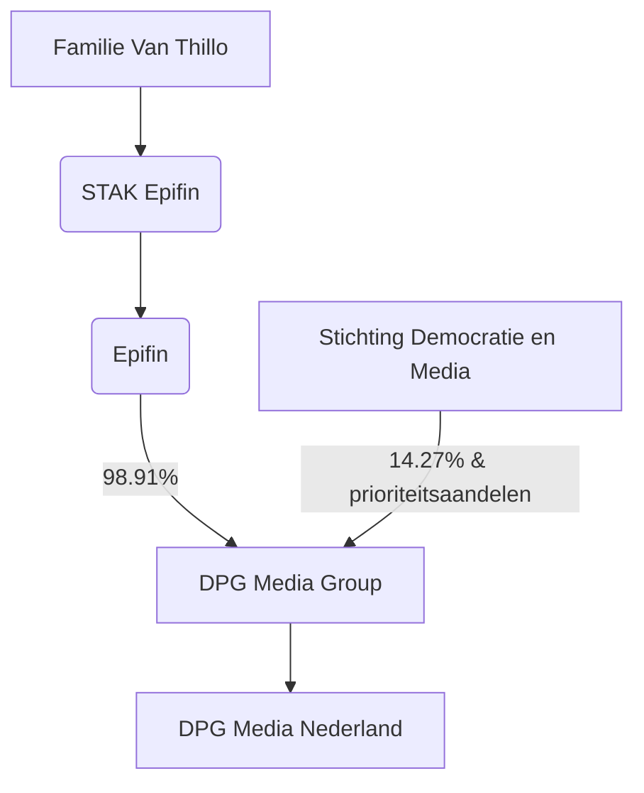

# Media-eigendom in Nederland Onderzocht
Door Smartbonnie.

## De Eigendomsstructuur van de Nederlandse Media: Een Analyse van Macht en Concentratie

### I. Executive Summary: Het Nederlandse Medialandschap in Vogelvlucht

Het Nederlandse medialandschap wordt gekenmerkt door een hoge mate van concentratie. Een beperkt aantal grote commerciële conglomeraten, met name DPG Media, RTL Nederland (waarvan de overname door DPG Media momenteel wordt beoordeeld), Mediahuis Nederland en Talpa Network, domineert samen met de publieke omroeporganisatie NPO de markt voor nieuws en informatie. Achter deze commerciële entiteiten gaan vaak complexe, internationale eigendomsstructuren schuil, waarbij de invloed van enkele families significant is. Toezichthoudende organen zoals het Commissariaat voor de Media (CvdM) en de Autoriteit Consument & Markt (ACM) spelen een cruciale rol in het monitoren van deze geconcentreerde markt.

De constatering dat deze mediabedrijven de "meest gebruikte" nieuws- en informatiebronnen in handen hebben [1], reikt verder dan louter marktaandeel. Het impliceert dat de eigenaars van deze bronnen een aanzienlijke, zij het niet per se bewust aangewende, invloed kunnen uitoefenen op de publieke opinievorming en het maatschappelijk debat. De kanalen waarmee burgers dagelijks in aanraking komen en hun informatie vergaren, worden immers grotendeels door deze spelers beheerd. Dit gegeven heeft potentieel belangrijke implicaties voor de democratische processen in Nederland.

Een zeer belangrijke actuele ontwikkeling is de voorgenomen overname van RTL Nederland door DPG Media. Deze transactie, indien goedgekeurd, zou niet zomaar een fusie zijn, maar een potentiële paradigmaverschuiving. Het zou een reeds geconcentreerde markt verder consolideren en een dominante crossmediale speler creëren met een ongekend bereik. De langdurige en diepgaande beoordeling door de ACM onderstreept de potentiële impact op mediamarkten, de diversiteit van het aanbod en de onderhandelingspositie van kleinere spelers.

Onderstaande tabel biedt een eerste overzicht van de belangrijkste mediaeigenaren in Nederland.

**Tabel 1: Overzicht van Belangrijke Mediaeigenaren in Nederland**

| Mediagroep                         | Primaire Uiteindelijke Eigenaar(s)/Controlerende Families/Moederbedrijf                                                                 | Voorbeelden Sleutelmerken in Nederland                                                              | Primaire Mediasector(en)        |
| ---------------------------------- | --------------------------------------------------------------------------------------------------------------------------------------- | --------------------------------------------------------------------------------------------------- | ------------------------------- |
| DPG Media                          | Familie Van Thillo (België) via Epifin/STAK Epifin; Stichting Democratie en Media (minderheidsbelang)                                     | AD, de Volkskrant, Trouw, NU.nl, Qmusic, diverse regionale kranten en tijdschriften                  | Print, Online, Radio            |
| RTL Nederland                      | RTL Group (Luxemburg), meerderheidsbelang Bertelsmann (Duitsland) (Overname door DPG Media is aangevraagd)                               | RTL 4, RTL 5, RTL Nieuws, Videoland, Buienradar                                                     | Televisie, Online, Streaming    |
| Mediahuis Nederland                | Mediahuis NV (België): Mediahuis Partners (o.a. families Leysen, Vlerick), Concentra (familie Baert), VP Capital (familie Van Puijenbroek) | De Telegraaf, NRC, Noordhollands Dagblad, De Limburger, Radio Veronica, Dumpert                     | Print, Online, Radio            |
| Talpa Network                      | John de Mol via Talpa Holding N.V.                                                                                                      | SBS6, Net5, Radio 538, Radio 10, Sky Radio, LINDA.                                                  | Televisie, Radio, Online, Print |
| Nederlandse Publieke Omroep (NPO) | Publieke rechtspersoon; bestuur en coördinatie door NPO-organisatie, politiek verantwoordelijke is Minister van OCW                      | NPO 1, NPO 2, NPO 3, NOS, NPO Start, diverse omroepverenigingen (KRO-NCRV, BNNVARA etc.)             | Televisie, Radio, Online        |

### II. De Pijlers van de Nederlandse Media: Grote Commerciële Conglomeraten

#### A. DPG Media: Een Grensoverschrijdende Machthebber

DPG Media is uitgegroeid tot het grootste mediabedrijf in Nederland, met een aanzienlijke omzet en een breed portfolio aan mediamerken. De wortels van het bedrijf liggen in België als De Persgroep, van waaruit het zijn activiteiten gestaag heeft uitgebreid naar de Nederlandse markt.

**Eigendomsstructuur**
De eigendom van DPG Media is voornamelijk geconcentreerd bij de Belgische familie Van Thillo. Deze controle wordt uitgeoefend via een gelaagde structuur. De holding Epifin houdt volgens cijfers uit 2022 98,91% van de aandelen in DPG Media [7]. Epifin wordt op haar beurt gecontroleerd door STAK Epifin, een Stichting Administratiekantoor naar Nederlands recht. Deze constructie, hoewel juridisch gangbaar, maakt de directe aandeelhouders en hun precieze individuele belangen minder transparant, maar het wordt algemeen aangenomen dat de familie Van Thillo de voornaamste begunstigden zijn. Het gebruik van een Stichting Administratiekantoor (STAK) is een in Nederland bekende juridische vorm die vaak wordt ingezet voor vermogensplanning, bescherming van bezit en het behouden van controle binnen een familie of een kleine groep, terwijl bredere economische participatie via certificaten mogelijk blijft. De STAK scheidt juridisch eigendom (berustend bij het stichtingsbestuur) van economisch eigendom (gehouden door certificaathouders). Het bestuur van de STAK, vaak gecontroleerd door de oprichters of hun familie, behoudt de stemrechten. Dit impliceert dat, hoewel de familie Van Thillo de economische begunstigden zijn, de STAK-structuur gecentraliseerde controle waarborgt en potentiële externe invloed of vijandige overnames beperkt, waardoor de dominantie van de familie over een significant deel van de Nederlandse media wordt versterkt.

Een opmerkelijke minderheidsaandeelhouder is Stichting Democratie en Media (SDM), die 14,27% van de aandelen houdt en tevens prioriteitsaandelen bezit in de kranten Trouw en de Volkskrant [9]. SDM heeft als doel de journalistieke onafhankelijkheid en continuïteit van deze titels te waarborgen. Hoewel SDM hiermee een mechanisme voor publiek belang binnen een commercieel bedrijf vertegenwoordigt, is haar invloed waarschijnlijk beperkt vergeleken met de meerderheidscontrole van de familie Van Thillo. De effectiviteit van SDM hangt af van de specifieke rechten verbonden aan de prioriteitsaandelen en haar vermogen om deze rechten uit te oefenen. Gezien Epifin, gecontroleerd door de familie Van Thillo, circa 99% van DPG Media bezit [7, 10], berust de algehele strategische en financiële controle bij hen. De invloed van SDM is eerder een gerichte waarborg voor specifieke journalistieke tradities dan een controle over de gehele strategie van DPG Media.

**Tabel 2: Vereenvoudigde Eigendomsstructuur van DPG Media**

Noot: Percentage van SDM is op DPG Media Group niveau, prioriteitsaandelen betreffen specifieke Nederlandse titels.
Sleutelmerken in Nederland
DPG Media bezit een indrukwekkend portfolio in Nederland [6]:
 * Nationale Dagbladen: Algemeen Dagblad (AD), de Volkskrant, Trouw.
 * Regionale Dagbladen: Onder andere Het Parool, Brabants Dagblad, BN DeStem, De Gelderlander, De Stentor, De Twentsche Courant Tubantia, Eindhovens Dagblad, Provinciale Zeeuwse Courant.
 * Tijdschriften: Donald Duck, Libelle, Flow. Veel van deze titels, evenals NU.nl, zijn verkregen door de overname van de Nederlandse activiteiten van Sanoma in 2019/2020.
 * Online Platforms: NU.nl (het grootste online nieuwsplatform van Nederland), Independer (vergelijkingssite), Tweakers (techplatform), Autotrack.nl.
 * Radio: Qmusic, Joe.
Strategische Positie en Marktinvloed
DPG Media is, gemeten naar omzet en bereik, de grootste mediaspeler in Nederland. Het bedrijf voert een actieve acquisitiestrategie, zoals blijkt uit de overname van Sanoma Nederland en de lopende poging om RTL Nederland in te lijven. Deze strategie versterkt zijn dominante positie in diverse mediamarkten.
B. RTL Nederland: Broadcasting Gigant met Internationale Wortels
RTL Nederland is een van de voornaamste commerciële televisieomroepen in Nederland, met een sterke positie in zowel lineaire televisie als digitale diensten [11, 12].
Eigendomsstructuur
RTL Nederland is een volledige dochteronderneming van de in Luxemburg gevestigde RTL Group. RTL Group is op haar beurt voor 76,29% eigendom van het Duitse internationale mediaconglomeraat Bertelsmann [13]. Een andere significante aandeelhouder in RTL Group is Silchester International Investors met circa 5% [13]. Deze internationale eigendomsstructuur betekent dat strategische beslissingen voor RTL Nederland uiteindelijk buiten Nederland worden genomen, potentieel met prioriteit voor de wereldwijde of Europese belangen van Bertelsmann. Hoewel Nederlandse regelgeving grenzen kan stellen, kunnen de belangen van de moedermaatschappij prevaleren boven specifieke Nederlandse marktbehoeften of publieke belangen. De voorgenomen verkoop aan DPG Media is een illustratie van een dergelijke strategische beslissing door RTL Group/Bertelsmann.
Sleutelmerken in Nederland
Het portfolio van RTL Nederland omvat [11, 12, 14]:
 * Televisiezenders: RTL 4 (vlaggenschip), RTL 5, RTL 7, RTL 8, RTL Z.
 * Digitale Betaalkanalen: RTL Crime, RTL Lounge, RTL Telekids.
 * Streamingdienst: Videoland, een belangrijke speler op de Nederlandse streamingmarkt.
 * Online Nieuws: RTL Nieuws (via RTL.nl), Buienradar (weerdienst), Editie NL.
 * Advertentiebureau: Ad Alliance, dat de advertentieverkoop voor de RTL-merken en andere partijen verzorgt.
Actuele Status: De Voorgenomen Overname door DPG Media
De meest significante recente ontwikkeling rond RTL Nederland is de aangekondigde overname door DPG Media in december 2023 voor een bedrag van €1,1 miljard [3, 15]. De Autoriteit Consument & Markt (ACM) oordeelde in mei 2024 dat een diepgaander onderzoek (tweede fase) noodzakelijk was vanwege mogelijke negatieve gevolgen voor de concurrentie, de kwaliteit van het nieuws en de advertentiemarkt [4, 16]. DPG Media heeft in juli 2024 formeel een vergunning aangevraagd [17]. Recente berichten uit mei 2025 suggereren dat de ACM mogelijk akkoord gaat met de overname onder bepaalde voorwaarden, zoals het gescheiden houden van de redacties van RTL Nieuws en NU.nl (van DPG Media) voor een periode van tien jaar en het oprichten van stichtingen ter waarborging van de journalistieke identiteit [3, 15, 18]. Een formeel besluit van de ACM was ten tijde van de meest recente informatie nog niet gepubliceerd.
De (mislukte) fusiepoging tussen RTL Nederland en Talpa Network in 2022 en de huidige overnamepoging door DPG Media wijzen op een sterke consolidatiedrang onder grote commerciële televisiespelers. Dit is waarschijnlijk ingegeven door de wens om schaalgrootte te bereiken ten opzichte van internationale streaminggiganten en om de advertentiemacht te consolideren. Het blokkeren van de eerste fusie en de kritische beoordeling van de huidige overname door de ACM tonen de regulatoire tegenkrachten die deze consolidatie proberen te beheersen.
C. Mediahuis Nederland: Belgische Wortels, Sterke Nederlandse Aanwezigheid
Mediahuis Nederland is een belangrijke uitgever van kranten en digitale media, voortgekomen uit de Telegraaf Media Groep (TMG) en nu onderdeel van het Belgische Mediahuis NV [19].
Eigendomsstructuur
Mediahuis Nederland is een dochteronderneming van het Belgische Mediahuis NV. De aandeelhouders van Mediahuis NV zijn [20, 21]:
 * Mediahuis Partners NV (voorheen Corelio) (circa 50,6%): Deze holding wordt gecontroleerd door verschillende Belgische families en investeringsgroepen, waaronder de familie Leysen (via Tradicor/Mediacore), de familie Vlerick (via Cecan), de familie Van Waeyenberge (via De Eik), de familie Van de Steen (via Vedesta) en de investeringsgroep Ackermans & van Haaren (via Sofinim/Mediacore).
 * Concentra NV (circa 32,3%): Deze groep wordt voornamelijk gecontroleerd door de Belgische familie Baert via Stichting De Zeven Eycken.
 * VP Exploitatie / VP Capital (circa 16,3%): Dit is het investeringsvehikel van de Nederlandse familie Van Puijenbroek, die historisch verbonden is met De Telegraaf.
Mediahuis Nederland zelf was voorheen Telegraaf Media Groep (TMG), dat na een biedingsstrijd met Talpa Network werd overgenomen door Mediahuis NV. Deze overnamestrijd onderstreept de strategische waarde die werd toegekend aan de activa van TMG, met name De Telegraaf. Het feit dat Mediahuis als winnaar uit de bus kwam, getuigt van haar financiële slagkracht en strategische vastberadenheid om een leidende rol te spelen in de Nederlandse printmedia. De eigendomsstructuur van Mediahuis NV vertegenwoordigt een consolidatie van historisch onderscheiden Belgische (Corelio, Concentra) en Nederlandse (Van Puijenbroek via TMG) mediabelangen. Deze alliantie is waarschijnlijk gevormd om een grotere, veerkrachtigere entiteit te creëren die beter bestand is tegen de krimpende printmarkt, kan investeren in digitale transformatie en geografisch kan uitbreiden, zoals ook gebeurd is naar Ierland en Duitsland.
Tabel 3: Vereenvoudigde Aandeelhoudersstructuur Mediahuis NV (Moederbedrijf Mediahuis Nederland)

| Aandeelhouder | Geschat Belang | Controlerende Families-Entiteiten (Voorbeelden) |
|---|---|---|
| Mediahuis Partners NV | ~50,6% | Families Leysen, Vlerick, Van Waeyenberge, Van de Steen; Ackermans & van Haaren |
| Concentra NV | ~32,3% | Familie Baert (via Stichting De Zeven Eycken) |
| VP Capital | ~16,3% | Familie Van Puijenbroek |
| Overige | ~0,8% |  |
| Bron: Gebaseerd op [21]. |  |  |

Sleutelmerken in Nederland
Mediahuis Nederland beheert een breed scala aan mediamerken [19, 22, 23, 24]:
 * Nationale Dagbladen: De Telegraaf (de grootste krant van Nederland), NRC Handelsblad (sinds 2015 eigendom van Mediahuis NV).
 * Tijdschriften: VROUW, Privé, Autovisie.
 * Regionale Dagbladen: Noordhollands Dagblad, Haarlems Dagblad, Leidsch Dagblad, IJmuider Courant, De Gooi- en Eemlander. Daarnaast vallen ook Mediahuis Noord (met o.a. Leeuwarder Courant, Dagblad van het Noorden) en Mediahuis Limburg (met o.a. De Limburger) onder de groep.
 * Digitale Platforms: Dumpert (videoplatform), Metro (online nieuws), Manners, Culy. GeenStijl werd in 2018 verkocht.
 * Radio: Radio Veronica (overgenomen van Talpa Network in 2023), Classic FM.
Marktstrategie en Portfolio
De strategie van Mediahuis is gericht op het versterken van zijn krantenmerken, het doorvoeren van digitale transformatie en het doen van strategische overnames, zoals TMG, NDC Mediagroep en recentelijk Radio Veronica. Dit duidt op een consolidatie in de printmedia en een uitbreiding van de digitale en radio-activiteiten.
D. Talpa Network: John de Mol's Media-Imperium
Talpa Network, opgericht door mediamagnaat John de Mol, is een belangrijke speler in de Nederlandse media, met een focus op televisie, radio en enkele digitale activiteiten [25, 26].
Eigendomsstructuur
Talpa Network is eigendom van John de Mol via zijn holdingmaatschappij Talpa Holding N.V.. In het verleden had De Mol belangen in RTL Nederland (verkocht in 2011) en Telegraaf Media Groep (TMG) (verkocht aan Mediahuis in 2017). De eigendomsstructuur is relatief eenvoudig in vergelijking met DPG Media of Mediahuis, aangezien de controle bij één persoon ligt.
Sleutelmerken in Nederland
De belangrijkste Nederlandse media-activa van Talpa Network zijn [27]:
 * Televisiezenders: SBS6 (vlaggenschip), Net5, Veronica, SBS9.
 * Radiozenders: Radio 538, Radio 10, Sky Radio. Radio Veronica werd in 2023 verkocht aan Mediahuis.
 * Digitaal/Overig: KIJK (online platform voor het terugkijken van programma's), LINDA. (tijdschrift en online platform, overgenomen van Sanoma in 2019), StukTV (populair YouTube-kanaal).
Recente Desinvesteringen en Focus
Talpa Network heeft de afgelopen jaren diverse onderdelen afgestoten:
 * De verkoop van Radio Veronica aan Mediahuis in 2023 was het gevolg van nieuwe regelgeving die het bezit van meer dan drie FM-frequenties door één partij verbiedt. Deze regulatoire ingreep, bedoeld om overconcentratie door Talpa in de radiomarkt te voorkomen, had als onbedoeld gevolg dat een andere grote speler, Mediahuis, zijn radioportfolio kon versterken. Dit illustreert de complexe en soms circulaire effecten van mediaregulering.
 * Persbureau ANP werd in 2021 verkocht.
 * De websites Gids.tv en Weer.nl werden in 2023 verkocht, omdat Talpa zich wilde concentreren op zijn kernmerken in televisie en radio.
 * Een poging tot fusie met RTL Nederland in 2022 werd door de ACM geblokkeerd.
Deze strategische zetten, waaronder overnames, fusiepogingen en desinvesteringen, suggereren een dynamische en soms volatiele koers. Dit kan een reflectie zijn van de strategische visie van een enkele eigenaar-ondernemer die reageert op marktveranderingen en regulatoire beperkingen, in tegenstelling tot de meer gestage, corporate groeistrategieën van de door families of consortia gecontroleerde mediagroepen DPG Media en Mediahuis.
III. De Publieke Tegenhanger: Nederlandse Publieke Omroep (NPO)
Naast de commerciële mediabedrijven speelt de Nederlandse Publieke Omroep (NPO) een cruciale rol in het Nederlandse medialandschap. De NPO is ontworpen om een pluriform en gevarieerd media-aanbod te bieden, onafhankelijk van commerciële belangen [28].
Organisatiestructuur en Bestuur
De NPO fungeert als het bestuursorgaan dat de programmering coördineert en het budget verdeelt over de verschillende publieke omroepverenigingen [29]. Deze omroepen zijn onder te verdelen in "taakomroepen" zoals NOS (nieuws, sport, actualiteiten) en NTR (cultuur, educatie, jeugd), die geen leden hebben maar een wettelijke opdracht vervullen, en "ledenbonden omroepen" zoals KRO-NCRV, BNNVARA en AVROTROS, die geworteld zijn in maatschappelijke stromingen en leden hebben. De minister voor Basis- en Voortgezet Onderwijs en Media is politiek verantwoordelijk voor het functioneren van het publieke omroepbestel.
Financieringsmodel
De publieke omroep wordt grotendeels gefinancierd uit belastinggeld, dat via de overheid wordt toegewezen [29]. Aanvullende inkomsten komen uit reclame (via de Stichting Ether Reclame - Ster) en in beperkte mate uit eigen bijdragen van omroepen of abonnementsgelden voor NPO Plus. Ongeveer 80% van het totale NPO-budget wordt besteed aan programmering. Deze financieringsstructuur, hoewel bedoeld om onafhankelijkheid te garanderen, maakt de NPO inherent gevoelig voor politieke besluitvorming en budgettaire aanpassingen. Veranderingen in de politieke wind of economische omstandigheden kunnen leiden tot bezuinigingen die de capaciteit van de NPO om haar publieke taak volledig uit te voeren, kunnen aantasten.
Rol in het Waarborgen van Mediapluriformiteit
De NPO heeft de wettelijke taak om een divers aanbod te verzorgen voor uiteenlopende doelgroepen, inclusief kleinere niches zoals kunst en cultuur, en voor verschillende bevolkingsgroepen [29]. Hiermee fungeert de NPO als een tegenwicht voor de commerciële media, met een focus op informatie, cultuur, educatie en maatschappelijke cohesie. De missie van het Commissariaat voor de Media omvat het waarborgen van een "pluriform" media-aanbod [2], een doelstelling waaraan de NPO een essentiële bijdrage levert. Hoewel de NPO streeft naar pluriformiteit via haar diverse omroepen, kan de centrale coördinatie en budgetallocatie door het NPO-bestuur zelf een spanningsveld creëren. Zorgvuldig management is vereist om te voorkomen dat deze centrale sturing leidt tot een zekere mate van homogenisering, ten koste van de unieke identiteiten en missies van de individuele omroepverenigingen.
Belangrijkste Kanalen en Platforms
Het aanbod van de NPO is breed en omvat [28, 29]:
 * Televisie: NPO 1 (breed, nationaal), NPO 2 (verdieping, cultuur), NPO 3 (gericht op jongeren).
 * Kinderzenders: NPO Zappelin (tot 6 jaar) en NPO Zapp (6 tot 12 jaar).
 * Digitale Platforms: NPO Start (gratis on-demand dienst), NPO Plus (betaalde abonnementsdienst voor uitgebreider en langer toegang tot content).
 * Thematische Kanalen: NPO 1 extra, NPO 2 extra, NPO Politiek en Nieuws.
 * Internationaal: BVN (gericht op Nederlandstaligen buiten Nederland).
IV. Concentratie en Concurrentie: Dynamiek van Mediaeigendom
De analyse van de individuele mediaeigenaren schetst een beeld van een sterk geconcentreerde Nederlandse mediamarkt. Deze concentratie heeft diverse implicaties voor concurrentie, pluriformiteit en de toegang tot informatie.
Analyse van Marktconcentratieniveaus
Zoals eerder genoemd, controleren de "Grote Vier" commerciële mediagroepen (DPG Media, RTL Nederland, Mediahuis Nederland, Talpa Network) samen met de NPO de meest gebruikte nieuws- en informatiebronnen in Nederland [1]. Deze dominantie is zichtbaar in verschillende segmenten:
 * Krantenmarkt: DPG Media en Mediahuis domineren zowel de landelijke als de regionale krantenmarkt.
 * Televisiemarkt: RTL Nederland en Talpa Network zijn de voornaamste commerciële televisieomroepen. De mogelijke overname van RTL Nederland door DPG Media zou deze concentratie in de televisiemarkt, en breder crossmediaal, aanzienlijk versterken.
 * Radiomarkt: DPG Media, Talpa Network en Mediahuis (sinds de overname van Radio Veronica) zijn significante spelers op de commerciële radiomarkt. Het CvdM monitort deze concentraties via de Mediamonitor, met een specifieke focus op de nieuws- en informatievoorziening [1]. Een rapport van de Vlaamse Regulator voor de Media, een vergelijkbare markt met deels dezelfde spelers (DPG Media, Mediahuis), stelde vast dat in Vlaanderen 80% tot 100% van de klassieke mediaproducten in handen is van slechts vijf mediagroepen [30]. Dit suggereert een vergelijkbaar hoog concentratieniveau in Nederland.
Crossmediaal Eigendom en de Implicaties
Grote spelers zoals DPG Media bezitten een uitgebreid portfolio dat kranten, online nieuwsplatforms, radiozenders en, indien de overname van RTL Nederland doorgaat, ook televisiezenders omvat. Mediahuis is sterk in print en digitaal en breidt uit in radio, terwijl Talpa Network actief is in televisie en radio. Dit crossmediale eigendom biedt aanzienlijke synergievoordelen, zoals cross-promotie, het delen van content en het bundelen van advertentieruimte. Dit creëert significante concurrentievoordelen ten opzichte van kleinere, gespecialiseerde spelers en kan de toetredingsdrempels voor nieuwe partijen verhogen. De CvdM Mediamonitor 2024 merkt op dat mediabedrijven consolidatie zien als een oplossing, waarschijnlijk om schaalvoordelen te behalen [1]. De Vlaamse Regulator voor de Media noemt DPG Media in Vlaanderen een "toonbeeld van een crossmediale mediagroep" [21].
De drang tot consolidatie bij Nederlandse mediabedrijven is niet alleen een defensieve reactie op de concurrentie van wereldwijde techgiganten zoals Google en Meta, die volgens de Mediamonitor 2024 bijna 80% van de digitale advertentie-inkomsten in Nederland opslokken [1]. Het is tevens een offensieve strategie om grote, crossmediale entiteiten te creëren die hogere advertentietarieven kunnen vragen en meer controle kunnen uitoefenen over contentdistributienetwerken binnen de nationale markt. Dit kan een vicieuze cirkel creëren waarbij schaalgrootte leidt tot verdere schaalvergroting.
Impact op Advertentiemarkten en Nieuwspluriformiteit
Mediaconcentratie kan leiden tot verminderde concurrentie op de advertentiemarkt, wat potentieel resulteert in hogere prijzen voor adverteerders. De ACM heeft bij de beoordeling van de DPG/RTL-fusie expliciet zorgen geuit over de versterkte positie van DPG Media in het aanbieden van gebundelde advertentiepakketten en de mogelijke negatieve gevolgen voor de advertentie-inkomsten van concurrenten [4]. Een afname van het aantal onafhankelijke nieuwseigenaren brengt het risico met zich mee van een versmalling van perspectieven en een afname van de diversiteit in de nieuwsverslaggeving. Dit is een kernzorg van het CvdM, dat als missie heeft de pluriformiteit van het media-aanbod te bewaken [2]. De ACM deelde deze zorg bij de DPG/RTL-overweging, wijzend op een mogelijke vermindering van "omvang, kwaliteit en pluriformiteit van het algemene nieuwsaanbod" [4].
Hoewel toezichthouders zoals de ACM zich richten op marktconcurrentie en nieuwspluraliteit [4, 5], kan de toenemende concentratie ook leiden tot een "talent drain" of verminderde kansen voor journalisten en mediamakers buiten de dominante conglomeraten. Dit zou op lange termijn indirect de innovatie en diversiteit kunnen aantasten, een aspect dat niet expliciet in de beschikbare bronnen wordt behandeld maar een logisch gevolg is van een kleiner aantal werkgevers. Een geconcentreerde markt met minder onafhankelijke mediabedrijven betekent minder verschillende werkgevers, wat kan leiden tot minder concurrentie om talent, potentieel lagere lonen of minder diverse carrièrepaden. Het kan ook resulteren in minder ruimte voor onconventionele of niche-content die niet past binnen de strategische prioriteiten van de grote conglomeraten, wat de algehele media-innovatie en diversiteit van stemmen kan beïnvloeden.
De Mediamonitor 2024 van het CvdM wijst op een "spagaat" voor mediabedrijven: enerzijds de noodzaak om aanwezig te zijn op sociale media voor bereik, anderzijds de wens om afhankelijkheid te vermijden en verkeer naar eigen platforms te leiden waar monetarisering eenvoudiger is [1]. Dit illustreert de complexe machtsdynamiek met wereldwijde platforms, waarbij zelfs grote nationale mediagroepen enigszins ondergeschikt zijn wat betreft toegang tot publiek en data. Sociale mediaplatforms controleren de toegang tot grote publieksgroepen, vooral jongeren [31], maar het omzetten van engagement op sociale media in directe inkomsten (abonnementen, directe advertentieverkoop) blijkt moeilijk voor mediabedrijven. Deze afhankelijkheid betekent dat Nederlandse mediaeigenaren niet volledig meester zijn over hun eigen lot, zelfs binnen de nationale markt, aangezien wereldwijde platforms de voorwaarden voor engagement en datatoegang dicteren.
V. Regelgevend Kader en Toezicht
Het Nederlandse medialandschap wordt gereguleerd door verschillende instanties en wettelijke kaders die eigendom, concurrentie en de publieke mediaopdracht bewaken.
A. Commissariaat voor de Media (CvdM): Hoeder van Pluriformiteit
Het Commissariaat voor de Media (CvdM) is een onafhankelijk bestuursorgaan dat toezicht houdt op de naleving van de Mediawet. De missie van het CvdM is het waarborgen van een onafhankelijk, toegankelijk, pluriform en veilig media-aanbod [2]. Een belangrijke statutaire taak is de publicatie van de jaarlijkse Mediamonitor, die ontwikkelingen in media-aanbieders en mediagebruik rapporteert, met een focus op nieuws en informatievoorziening [1]. Het CvdM ziet toe op de redactionele onafhankelijkheid en het voorkomen van oneigenlijke commerciële beïnvloeding. Daarnaast houdt het toezicht op de integriteit binnen de publieke omroep.
B. Autoriteit Consument & Markt (ACM): Garant voor Eerlijke Concurrentie
De Autoriteit Consument & Markt (ACM) speelt een cruciale rol in het handhaven van eerlijke concurrentie, onder andere door het beoordelen van fusies en overnames in de mediasector. De ACM kan fusies blokkeren, zoals gebeurde bij de voorgenomen fusie tussen RTL Nederland en Talpa Network in 2022 [5], of goedkeuren onder bepaalde voorwaarden. Belangrijke overwegingen bij mediafusies zijn de impact op de diversiteit en kwaliteit van het nieuws, de concentratie op advertentiemarkten, de onderhandelingsmacht ten opzichte van leveranciers (zoals persbureau ANP) en de arbeidsvoorwaarden voor journalisten.
De lopende beoordeling van de overname van RTL Nederland door DPG Media is een sprekend voorbeeld van de rol van de ACM. De ACM constateerde de noodzaak van een diepgaand onderzoek (tweede fase) vanwege zorgen over de versterkte dominantie van DPG Media in de nieuwssector, mogelijke schade aan de kwaliteit en pluriformiteit van het nieuws, en effecten op de advertentiemarkt [4]. Recente berichtgeving (mei 2025) duidt op een mogelijke voorwaardelijke goedkeuring [3, 15, 18].
Er bestaat een inherente spanning tussen het mandaat van het CvdM om pluriformiteit te waarborgen en de op concurrentie gerichte taken van de ACM. Hoewel deze vaak parallel lopen, kan een fusie de concurrentietoetsen van de ACM doorstaan (bijvoorbeeld als er voldoende spelers overblijven in een eng gedefinieerde markt) maar toch de algehele mediapluriformiteit vanuit maatschappelijk oogpunt verminderen. De DPG/RTL-zaak, waarbij de ACM advies inwint bij het CvdM [4], toont een poging om deze kloof te overbruggen. Echter, de uiteindelijke beslissingsmacht bij fusies ligt bij de ACM, wat kan betekenen dat de kernzorgen van het ene orgaan niet volledig worden geadresseerd als ze niet overeenkomen met de primaire juridische toetsen van het andere.
Een interessante ontwikkeling is de toenemende aandacht van de ACM voor de impact van mediafusies op de arbeidsmarkt voor journalisten, zowel in loondienst als freelancers [4, 5]. Dit signaleert een verbreding van de traditionele focus bij fusiebeoordelingen. Het reflecteert een groeiend inzicht dat mediaconcentratie niet alleen consumenten en adverteerders raakt, maar ook de producenten van mediacontent, wat indirect de kwaliteit en diversiteit kan beïnvloeden. Als mediabedrijven te machtig worden als werkgevers, zouden ze lonen of arbeidsvoorwaarden kunnen drukken, wat het beroep minder aantrekkelijk maakt en op termijn kan leiden tot een afname van de kwaliteit of diversiteit van journalistiek talent.

Tabel 4: Belangrijke Recente Regulatoire Interventies in de Nederlandse Mediamarkt

| Geval | Toezichthouder | Datum Kernbesluit(en) | Uitkomst/Status (per medio 2025) | Belangrijkste Zorgen |
|---|---|---|---|---|
| Poging tot fusie RTL Nederland/Talpa Network | ACM | 2022 (blokkade) | Geblokkeerd | Te grote macht op commerciële mediamarkt, negatieve gevolgen voor concurrentie. |
| Overname RTL Nederland door DPG Media | ACM | Mei 2024 (besluit tot 2e fase onderzoek);   Juli 2024 (vergunningsaanvraag DPG) | Vergunningsaanvraag in behandeling;   berichten over mogelijke voorwaardelijke goedkeuring (o.a. gescheiden redacties RTL Nieuws/NU.nl voor 10 jaar, stichtingen voor journalistieke identiteit). | Versterking dominante positie DPG Media, mogelijke verlaging kwaliteit/toegankelijkheid nieuws, impact pluriformiteit, effecten advertentiemarkt, onderhandelingspositie t.o.v. ANP, arbeidsvoorwaarden journalisten. |

VI. Toekomstperspectief en Belangrijke Overwegingen
De Nederlandse media-eigendomsstructuur staat niet stil. Lopende ontwikkelingen en structurele uitdagingen zullen het landschap in de komende jaren verder vormgeven.
Implicaties van de DPG Media/RTL Nederland Fusie (indien goedgekeurd)
Indien de overname van RTL Nederland door DPG Media wordt goedgekeurd, zelfs met voorwaarden, zal dit leiden tot de creatie van een ongekend dominante crossmediale speler. Dit conglomeraat zou een zeer sterke positie innemen in nieuws (zowel print als online via merken als AD, de Volkskrant, Trouw, NU.nl en dan RTL Nieuws), televisie (RTL-zenders en Videoland), en een significante rol in radio (Qmusic, Joe) en de advertentiemarkt. Dit brengt potentieel risico's met zich mee voor kleinere concurrenten, adverteerders en contentleveranciers die te maken krijgen met een nog machtiger marktpartij. De effectiviteit van eventuele door de ACM opgelegde remedies, zoals de gerapporteerde tienjarige scheiding van nieuwsredacties [3, 15, 18], zal cruciaal zijn en vereist voortdurende monitoring. Het succes van dergelijke "gedragsremedies" hangt sterk af van de robuustheid van de handhavingsmechanismen en de daadwerkelijke commitment van de gefuseerde entiteit. Er bestaat een risico dat dergelijke voorwaarden na verloop van tijd eroderen of moeilijk effectief te monitoren blijken, wat alsnog kan leiden tot de gevreesde negatieve gevolgen van concentratie.
Uitdagingen voor de Nederlandse Media
Het Nederlandse medialandschap staat voor diverse structurele uitdagingen:
 * Internationale Techgiganten: De aanhoudende druk van internationale technologiebedrijven zoals Google en Meta op het gebied van publieksaandacht en advertentie-inkomsten blijft een grote factor [1].
 * Veranderend Consumptiegedrag: Vooral jongere doelgroepen wenden zich steeds meer tot sociale media voor nieuws en entertainment, wat traditionele media dwingt hun strategieën aan te passen. Uit het Digital News Report Nederland 2024 blijkt dat voor jongeren van 18 tot 24 jaar sociale media de voornaamste nieuwsbron is, waarbij met name Instagram, YouTube en TikTok populair zijn [31].
 * Financiële Viabiliteit van Kwaliteitsjournalistiek: De teruglopende inkomsten uit print en de uitdagingen bij het monetariseren van online content zetten de financiële basis van kwaliteitsjournalistiek onder druk.
 * Mediawijsheid en Desinformatie: Het vergroten van mediawijsheid en het bestrijden van desinformatie in een steeds complexer en gefragmenteerder medialandschap is een belangrijke maatschappelijke opgave [32].
Het Nederlandse medialandschap zou een groeiende tweedeling kunnen gaan vertonen tussen enkele zeer grote, geconsolideerde nationale spelers (zoals een potentieel DPG/RTL-conglomeraat, Mediahuis, Talpa Network en de NPO) en een kwetsbare laag van kleinere, lokale of nichemedia. Dit "haltereffect" kan het hyperlokale nieuwsecosysteem en gespecialiseerde content, die vitaal zijn voor gemeenschapsbetrokkenheid en diverse informatievoorziening, in gevaar brengen. Deze kleinere spelers missen vaak de schaalgrootte om te concurreren om advertentie-inkomsten of te investeren in noodzakelijke technologie. Dit zou kunnen leiden tot "nieuwswoestijnen" in sommige lokale gebieden of een gebrek aan gespecialiseerde berichtgeving als kleinere mediabedrijven niet kunnen overleven, waardoor de informatiemacht verder geconcentreerd raakt bij de grote spelers. De daling van het aantal regionale edities van nationale kranten en het verdwijnen van veel gratis lokale/regionale bladen in Vlaanderen na de coronacrisis zou een voorbode kunnen zijn van een vergelijkbare trend in Nederland [30].
De Evoluerende Rol van Regulering
De dynamiek in het medialandschap vereist een wendbare en toekomstgerichte regulering. Toezichthouders staan voor de uitdaging om de macht van grote, crossmediale conglomeraten en internationale platforms te adresseren, terwijl ze een balans moeten vinden tussen de wens van mediabedrijven om te consolideren voor schaalgrootte en de noodzaak om pluriformiteit, concurrentie en journalistieke onafhankelijkheid te beschermen. Mogelijk zijn nieuwe reguleringsbenaderingen nodig om eerlijke concurrentie met wereldwijde techplatforms te waarborgen en lokale journalistiek te ondersteunen. De focus van het CvdM op "mediawijsheid" en onderzoek naar nieuwsgebruik onder jongeren duidt op een verbreding van de regulatoire aandacht, voorbij enkel eigendomsstructuren [1, 31, 32].
Hoewel de focus vaak ligt op traditioneel media-eigendom, betekent de toenemende afhankelijkheid van internationale sociale mediaplatforms voor nieuwsconsumptie, met name onder jongeren [31], dat een significant deel van de "mediapoortwachtersfunctie" al buiten de controle van Nederlandse eigenaren en regelgevers valt. Platforms zoals Instagram, YouTube en TikTok, eigendom van grote internationale techbedrijven (Meta, Google, ByteDance), bepalen via algoritmen in grote mate de zichtbaarheid van nieuws en opereren grotendeels buiten de Nederlandse mediaspecifieke regelgeving. Dit vormt een fundamentele uitdaging voor het nationale mediabeleid en de inspanningen om een goed geïnformeerde burgerij te waarborgen, aangezien een groeiend deel van de nieuwsconsumptie onderhevig is aan de ondoorzichtige regels en commerciële belangen van deze wereldwijde bedrijven.
VII. Conclusies
De eigendomsstructuur van de Nederlandse media wordt gekenmerkt door een significante en toenemende mate van concentratie. Enkele grote, deels internationaal en familiaal gecontroleerde, commerciële conglomeraten – DPG Media, RTL Nederland (met een aanstaande mogelijke overname door DPG Media), Mediahuis Nederland en Talpa Network – domineren, samen met de publieke omroep NPO, de toegang tot nieuws en informatie voor het Nederlandse publiek.
Deze concentratie heeft verstrekkende implicaties. De macht over de "meest gebruikte" informatiekanalen ligt bij een klein aantal entiteiten, wat vragen oproept over de pluriformiteit van het nieuws, de diversiteit aan perspectieven en de potentiële invloed op de publieke opinie. De crossmediale verwevenheid van deze conglomeraten versterkt hun marktpositie, met name op de advertentiemarkt, en kan drempels opwerpen voor kleinere spelers en nieuwe toetreders.
De voorgenomen overname van RTL Nederland door DPG Media, indien goedgekeurd, zal deze concentratie verder intensiveren en leiden tot een mediagigant met een ongekend bereik over print, online, televisie en radio. De voorwaarden die de Autoriteit Consument & Markt (ACM) mogelijk stelt, zoals het gescheiden houden van redacties, zullen cruciaal zijn voor het mitigeren van de negatieve gevolgen, maar de effectiviteit en handhaving hiervan op lange termijn blijven een aandachtspunt.
De Nederlandse Publieke Omroep (NPO) vervult een essentiële rol als tegenwicht, met een wettelijke taak om een pluriform en onafhankelijk aanbod te verzorgen. De financiering via overheidsmiddelen maakt de NPO echter ook kwetsbaar voor politieke invloeden en budgettaire beperkingen.
Regelgevende instanties zoals het Commissariaat voor de Media (CvdM) en de ACM staan voor de complexe taak om in dit dynamische veld de balans te bewaken tussen de economische realiteit van de mediasector (waaronder de concurrentie met internationale techgiganten) en fundamentele publieke belangen zoals pluriformiteit, onafhankelijke journalistiek en eerlijke concurrentie. De toenemende aandacht voor de arbeidsmarktpositie van journalisten en de impact van internationale platforms op nieuwsconsumptie wijzen op een verbreding van het regulatoire perspectief.
De toekomst van het Nederlandse medialandschap zal worden bepaald door de wisselwerking tussen verdere consolidatietrends, de strategische keuzes van de grote mediabedrijven, de impact van wereldwijde technologische spelers, veranderend mediagebruik en de effectiviteit van het regulatoire kader. Het waarborgen van een divers, toegankelijk en betrouwbaar media-aanbod, essentieel voor een goed functionerende democratie, blijft in deze context een voortdurende uitdaging.
## Geciteerd werk

1. [www.cvdm.nl](https://www.cvdm.nl/wp-content/uploads/2024/12/CvdM-Mediamonitor-2024.pdf)
2. [Evaluatie Commissariaat voor de Media](https://zoek.officielebekendmakingen.nl/blg-1136407.pdf)
3. [FD: overname RTL Nederland door DPG Media bijna rond bij ACM - Marketing Report](https://marketingreport.nl/fd-overname-rtl-nederland-door-dpg-media-bijna-rond-bij-acm/)
4. [Nader onderzoek nodig naar overname RTL Nederland Holding en RTL Nederland Media Services door DPG Media - concentratiebesluit - ACM](https://www.acm.nl/nl/publicaties/nader-onderzoek-nodig-naar-overname-rtl-nederland-holding-en-rtl-nederland-media-services-door-dpg-media-concentratiebesluit)
5. [Merger supervision ACM 2024 - Taylor Wessing](https://www.taylorwessing.com/en/insights-and-events/insights/2025/02/merger-supervision-acm-2024)
6. [Who we are - DPG Media The Netherlands](https://www.dpgmediagroup.com/en-BE/dpgmedia-nederland)
7. [DPG Media - Wikipedia](https://en.wikipedia.org/wiki/DPG_Media)
8. [Christian Van Thillo - Wikipedia](https://en.wikipedia.org/wiki/Christian_Van_Thillo)
9. [Aandeelhouderschap - Stichting Democratie en Media](https://sdm.nl/en/wat-we-doen/aandeelhouderschap/)
10. [Christian Van Thillo - DPG Media Annual Report 2023](https://jaarverslag.dpgmediagroup.com/2023-en/christian_van_thillo)
11. [RTL Nederland](https://company.rtl.com/en/business-units/overview/rtl-nederland/)
12. [RTL (Nederland) - Wikipedia](https://nl.wikipedia.org/wiki/RTL_(Nederland))
13. [RTL Group - Wikipedia](https://en.wikipedia.org/wiki/RTL_Group)
14. [RTL Nederland - Wikipedia](https://en.wikipedia.org/wiki/RTL_Nederland)
15. [Media group DPG's takeover of RTL Nederland set to go ahead - DutchNews.nl](https://www.dutchnews.nl/2025/05/media-group-dpgs-takeover-of-rtl-nederland-set-to-go-ahead/)
16. [ACM: meer onderzoek nodig naar overname RTL door DPG](https://www.acm.nl/nl/publicaties/acm-meer-onderzoek-nodig-naar-overname-rtl-door-dpg)
17. [DPG Media, RTL Nederland Holding en RTL Nederland Media Services vragen een vergunning aan voor overname (concentratiemelding) - ACM](https://www.acm.nl/nl/publicaties/dpg-media-rtl-nederland-holding-en-rtl-nederland-media-services-vragen-een-vergunning-aan-voor-overname-concentratiemelding)
18. [Overname RTL Nederland mogelijk na knieval DPG Media - M&A - MenA.nl](https://mena.nl/artikel/ovename-rtl-nederland-mogelijk-na-knieval-dpg-media/)
19. [nl.wikipedia.org](https://nl.wikipedia.org/wiki/Mediahuis_Nederland)
20. [Mediahuis - Wikipedia](https://en.wikipedia.org/wiki/Mediahuis)
21. [www.vlaamseregulatormedia.be](https://www.vlaamseregulatormedia.be/nl/over-vrm/rapporten/2020/rapport-mediaconcentratie/mediaconcentratie-in-vlaanderen-2020/2-1)
22. [www.mediahuis.nl](https://www.mediahuis.nl/#:~:text=Mediahuis%20is%20%C3%A9%C3%A9n%20van%20de,Famme%2C%20Bedrock%2C%20WANT%2C%20Culy)
23. [Ontdek onze merken - Werken bij Mediahuis](https://www.werkenbijmediahuis.nl/onze-merken/1560-mediahuis)
24. [Mediahuis Nederland - Thuis in Media](https://www.mediahuis.nl/en/)
25. [Talpa Network - Wikipedia](https://nl.wikipedia.org/wiki/Talpa_Network)
26. [Talpa Network Logo & Brand Assets (SVG, PNG and vector) - Brandfetch](https://brandfetch.com/brandnewtelly.com)
27. [Onze merken. - Talpa Network.](https://talpanetwork.com/adverteren/onze-merken/)
28. [Wie we zijn - NPO](https://npo.nl/overnpo/wie-we-zijn)
29. [Wat doet de Nederlandse Publieke Omroep (NPO)? - Rijksoverheid.nl](https://www.rijksoverheid.nl/onderwerpen/media-en-publieke-omroep/vraag-en-antwoord/nederlandse-publieke-omroep)
30. [Mediaconcentratie - Vlaamse Regulator voor de Media](https://www.vlaamseregulatormedia.be/nl/mediaconcentratie)
31. [Digital News Report Nederland 2024 - Commissariaat voor de Media](https://www.cvdm.nl/wp-content/uploads/2024/06/2031086-CvdM-DigitalNewsReport-2024_def.pdf)
32. [Rapport Mediawijsheid Onderzoek 2023](https://netwerkmediawijsheid.nl/onderzoek/rapport-mediawijsheid-onderzoek-2023/)

